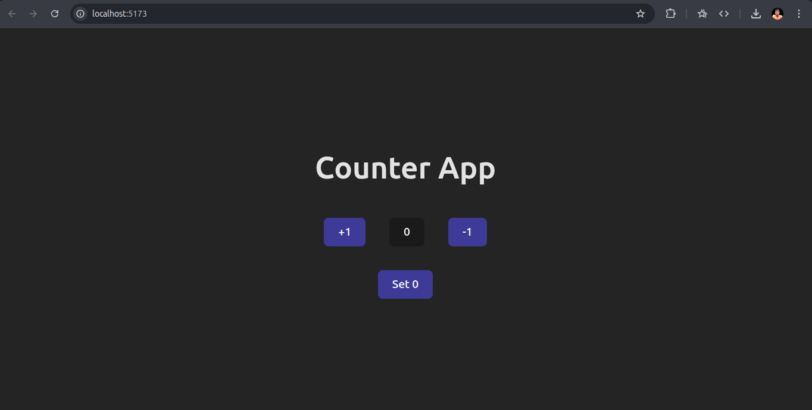

# 🚀 My First React Project

This is my first React project built using Vite and React. It’s a simple starter app to help beginners learn the basics of React, component structure, and state management.

---

## 📁 Project Structure

```
Counter/
├── node_modules/
├── public/
├── src/
│   ├── App.jsx
│   ├── main.jsx
│   └── ...
├── .gitignore
├── index.html
├── package.json
├── README.md
└── vite.config.js
```

---

## 🛠️ Getting Started

Follow the instructions below to run this project on your local machine.

### ✅ Prerequisites

Make sure you have the following installed:

- [Node.js](https://nodejs.org/) (version 16 or higher recommended)
- [npm](https://www.npmjs.com/) or [yarn](https://yarnpkg.com/)
- A code editor like [VS Code](https://code.visualstudio.com/)

---

### 🚀 Installation

1. **Clone the Repository**

```bash
git clone https://github.com/prabhanshtiwari/Counter-App.git
```

2. **Navigate to the Project Folder**

```bash
cd Counter-App
```

3. **Install Dependencies**

Using npm:

```bash
npm install
```

Or using yarn:

```bash
yarn
```

---

### 📦 Start the Development Server

Using npm:

```bash
npm run dev
```

Or using yarn:

```bash
yarn dev
```

This will start a local server and you can view the app in your browser at:

```
http://localhost:5173/
```

---

## 🧠 What I Learned

- How to set up a React project using Vite
- How to use components and `useState` hook
- How to run a React app locally

---

## 📸 Screenshots



---

## 🙌 Contributing

Feel free to fork this repo and make changes. If you find any issues or want to suggest improvements, open an issue or pull request.

---

## 📃 License

This project is open-source and free to use.

---

## 🔗 Connect With Me

- GitHub: [prabhanshtiwari](https://github.com/prabhanshtiwari)
- LinkedIn: [prabhanshtiwari](https://linkedin.com/in/prabhanshtiwari)